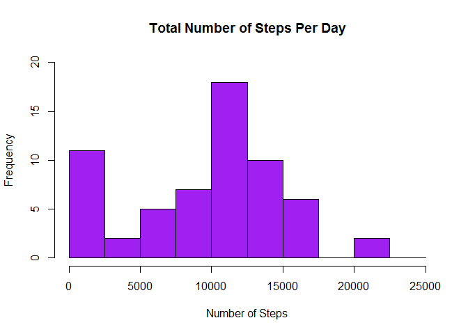
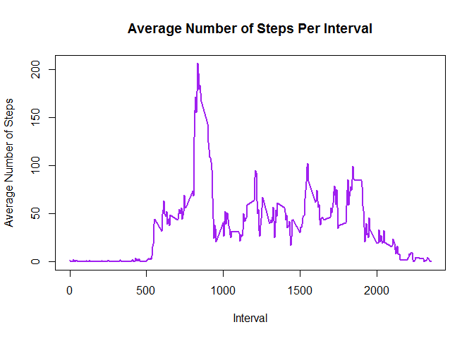
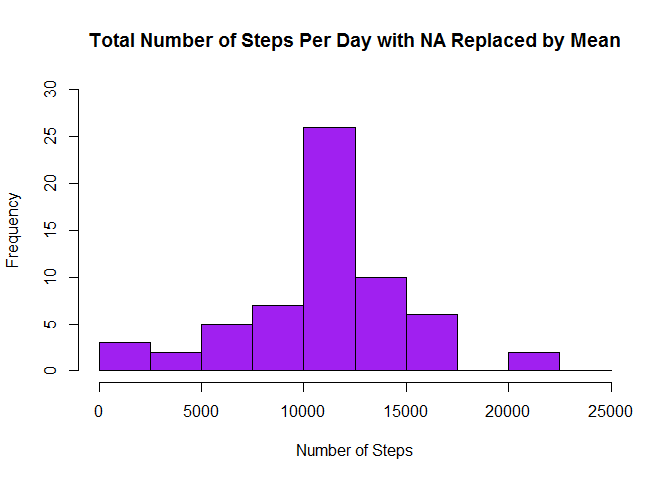
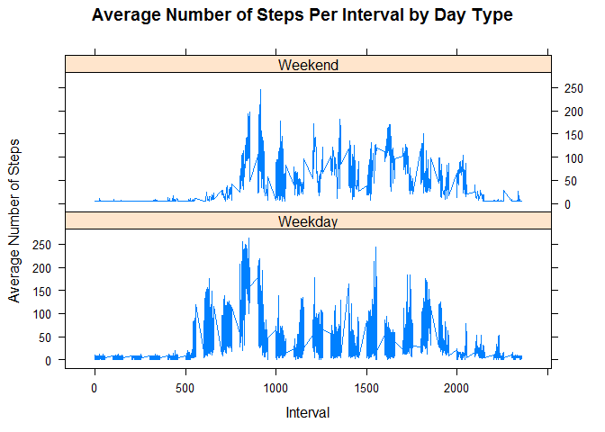

##Loading and preprocessing the data

1. Load the data 


```r
setwd("C:/Users/lpost/My Documents/Coursera/05 - Reproducible Research")
activity <- read.csv("activity.csv")
```

2. Process/transform the data (if necessary) into a format suitable for your analysis


```r
activity$date <- as.POSIXct(activity$date, format="%Y-%m-%d")
```

##What is mean total number of steps taken per day?

1. Calculate the total number of steps taken per day


```r
sum_data <- aggregate(activity$steps, by=list(activity$date), FUN=sum, na.rm=TRUE)
colnames(sum_data) <- c("Date", "Number of Steps")
```

Here is a table of the total number of steps taken per day.


```r
sum_data
```

```
##          Date Number of Steps
## 1  2012-10-01               0
## 2  2012-10-02             126
## 3  2012-10-03           11352
## 4  2012-10-04           12116
## 5  2012-10-05           13294
## 6  2012-10-06           15420
## 7  2012-10-07           11015
## 8  2012-10-08               0
## 9  2012-10-09           12811
## 10 2012-10-10            9900
## 11 2012-10-11           10304
## 12 2012-10-12           17382
## 13 2012-10-13           12426
## 14 2012-10-14           15098
## 15 2012-10-15           10139
## 16 2012-10-16           15084
## 17 2012-10-17           13452
## 18 2012-10-18           10056
## 19 2012-10-19           11829
## 20 2012-10-20           10395
## 21 2012-10-21            8821
## 22 2012-10-22           13460
## 23 2012-10-23            8918
## 24 2012-10-24            8355
## 25 2012-10-25            2492
## 26 2012-10-26            6778
## 27 2012-10-27           10119
## 28 2012-10-28           11458
## 29 2012-10-29            5018
## 30 2012-10-30            9819
## 31 2012-10-31           15414
## 32 2012-11-01               0
## 33 2012-11-02           10600
## 34 2012-11-03           10571
## 35 2012-11-04               0
## 36 2012-11-05           10439
## 37 2012-11-06            8334
## 38 2012-11-07           12883
## 39 2012-11-08            3219
## 40 2012-11-09               0
## 41 2012-11-10               0
## 42 2012-11-11           12608
## 43 2012-11-12           10765
## 44 2012-11-13            7336
## 45 2012-11-14               0
## 46 2012-11-15              41
## 47 2012-11-16            5441
## 48 2012-11-17           14339
## 49 2012-11-18           15110
## 50 2012-11-19            8841
## 51 2012-11-20            4472
## 52 2012-11-21           12787
## 53 2012-11-22           20427
## 54 2012-11-23           21194
## 55 2012-11-24           14478
## 56 2012-11-25           11834
## 57 2012-11-26           11162
## 58 2012-11-27           13646
## 59 2012-11-28           10183
## 60 2012-11-29            7047
## 61 2012-11-30               0
```

2. Make a histogram of the total number of steps taken each day


```r
hist(sum_data$`Number of Steps`, breaks=seq(from=0, to=25000, by=2500), col="purple", xlab="Number of Steps", ylim = c(0,20), main = "Total Number of Steps Per Day")
```

<!-- -->

3. Calculate and report the mean and median of the total number of steps taken per day


```r
mean(sum_data$`Number of Steps`)
```

```
## [1] 9354.23
```

```r
median(sum_data$`Number of Steps`)
```

```
## [1] 10395
```

The mean number of steps taken per day is 9,354.

The median number of steps taken per day is 10,395.

##What is the average daily activity pattern?

1. Make a time series plot of the 5-minute interval (x-axis) and the average number of steps taken, averaged across all days (y-axis)


```r
mean_data <- aggregate(activity$steps, by=list(activity$interval), FUN=mean, na.rm=TRUE)
colnames(mean_data) <- c("Interval", "Average Number of Steps")
plot(mean_data$Interval, mean_data$`Average Number of Steps`, type="l", col="purple", lwd=2, xlab="Interval", ylab="Average Number of Steps", main="Average Number of Steps Per Interval")
```

<!-- -->

2. Which 5-minute interval, on average across all the days in the dataset, contains the maximum number of steps?


```r
max_steps <- which(mean_data$`Average Number of Steps` == max(mean_data$`Average Number of Steps`))
max_interval <- mean_data[max_steps,1]
max_interval
```

```
## [1] 835
```

The 5-minute interval that contains the maximum number of steps is 835.

##Imputing missing values

1. Calculate and report the total number of missing values in the dataset


```r
nrow(activity[is.na(activity$steps),])
```

```
## [1] 2304
```

The total number of missing values (rows with NA) is 2,304.

2. Devise a strategy for filling in all of the missing values in the dataset. The strategy does not need to be sophisticated. For example, you could use the mean/median for that day, or the mean for that 5-minute interval, etc.


```r
NA_row <- which(is.na(activity$steps))
mean_steps <- rep(mean(activity$steps, na.rm=TRUE), times=length(NA_row))
```

My strategy for filling in all of the missing values is substituting the missing steps with the mean number of steps per 5-minute interval.

3. Create a new dataset that is equal to the original dataset but with the missing data filled in.


```r
activity[NA_row, "steps"] <- mean_steps
```

Here are the first few rows of the new dataset with the missing data filled in with the mean number of steps per 5-minute interval.


```r
head(activity)
```

```
##     steps       date interval
## 1 37.3826 2012-10-01        0
## 2 37.3826 2012-10-01        5
## 3 37.3826 2012-10-01       10
## 4 37.3826 2012-10-01       15
## 5 37.3826 2012-10-01       20
## 6 37.3826 2012-10-01       25
```

4. Make a histogram of the total number of steps taken each day and calculate and report the mean and median total number of steps taken per day. Do these values differ from the estimates from the first part of the assignment? What is the impact of imputing missing data on the estimates of the total daily number of steps?


```r
sum_data2 <- aggregate(activity$steps, by=list(activity$date), FUN=sum)
colnames(sum_data2) <- c("Date", "Number of Steps")
hist(sum_data2$`Number of Steps`, breaks=seq(from=0, to=25000, by=2500), col="purple", xlab="Number of Steps", ylim = c(0,30), main = "Total Number of Steps Per Day with NA Replaced by Mean")
```

<!-- -->

```r
mean(sum_data2$`Number of Steps`)
```

```
## [1] 10766.19
```

```r
median(sum_data2$`Number of Steps`)
```

```
## [1] 10766.19
```

The new mean number of steps taken per day is 10,766 compared to the old mean of 9,354. This creates a difference of 1,412 more steps per day.

The new median number of steps taken per day is 10,766 compared to the old median of 10,395. This creates a difference of 371 more steps per day.

There is less frequency of 0 number of steps, but the overall shape of the distribution has not changed.

##Are there differences in activity patterns between weekdays and weekends?

1. Create a new factor variable in the dataset with two levels - "weekday" and "weekend" indicating whether a given date is a weekday or weekend day.


```r
activity$day <- weekdays(as.Date(activity$date))
activity$daytype <- ifelse(activity$day %in% c("Saturday", "Sunday"), "Weekend", "Weekday")
```

Here are the first few rows of the new dataset with a variable indicating whether a given date is a weekday or weekend.


```r
head(activity)
```

```
##     steps       date interval    day daytype
## 1 37.3826 2012-10-01        0 Monday Weekday
## 2 37.3826 2012-10-01        5 Monday Weekday
## 3 37.3826 2012-10-01       10 Monday Weekday
## 4 37.3826 2012-10-01       15 Monday Weekday
## 5 37.3826 2012-10-01       20 Monday Weekday
## 6 37.3826 2012-10-01       25 Monday Weekday
```

2. Make a panel plot containing a time series plot of the 5-minute interval (x-axis) and the average number of steps taken, averaged across all weekday days or weekend days (y-axis).


```r
library(lattice)
mean_data2 <- aggregate(activity$steps, by=list(activity$daytype, activity$day, activity$interval), mean)
colnames(mean_data2) <- c("Day_Type", "Day", "Interval", "Average_Number_of_Steps")
xyplot(Average_Number_of_Steps ~ Interval | Day_Type, mean_data2, type="l", lwd=1, xlab="Interval", ylab="Average Number of Steps", main="Average Number of Steps Per Interval by Day Type", layout=c(1,2))
```

<!-- -->
